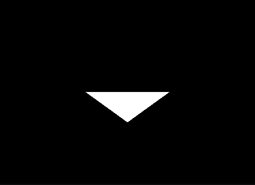

# Overview

>
> NB: Work in progress
> ===

TRL-3D is a system/API that makes it easier for C# programmers to access accelerated 3D graphics, using OpenGL 4.5 via the [OpenTk](https://github.com/opentk/opentk) library. The main features of TRL-3D are:

* It specifies 3D content using batches of easy-to-use assertions.
* It identifies objects (vertices, triangles etc.) using object IDs instead of object references. This allows partial content to be specified.
* It is multi-threaded, with events being passed out of the rendering system, and assertions specifying content and render commands being passed in. In this is done via the [.NET Channel class](https://devblogs.microsoft.com/dotnet/an-introduction-to-system-threading-channels/).
* It is abstracted from OpenGL in such a way that another rendering system (ex. Vulkan, DirectX) can be implemented in the future.
* It uses .NET dependency injection and logging to create a clean maintainable system architecture.

# Rendering a triangle

The most fundamental concept in TRL-3D is the _assertion_. Assertions are statements about the world rather than render commands. Here is an example of a set of assertions that draws a triangle:

```C#
// Assertions are batched together for efficiency
var batch = new AssertionBatch
{
    Assertions = new IAssertion[]
    {
        // Define vertices
        new Vertex(9, new Coordinate3d(-0.33f, 0.0f, -1.0f)),
        new Vertex(10, new Coordinate3d(0.33f, 0.0f, -1.0f)),
        new Vertex(11, new Coordinate3d(0.0f,  -0.33f, -1.0f)),

        // Define triangle
        new Triangle(12, (9, 10, 11))
    }
};
```

First three vertices are defined. Each vertex contains an ID and coordinates. Then these vertices are grouped into a triangle. The rendering system works out that there is a complete triangle, loads it into a vertex buffer, and renders it on the screen. This is done transparently without programmer intervention. The result looks like this:



More assertions are supported for adding textures and colours. (See the sample app in this repository.)

# Basic configuration

Four basic interfaces ("services" when they are implemented for dependency injection) need to be implemented in order to use the system. These interfaces are:

* `IEventProcessor` - This interface implementation receives events from the system, ex. keyboard, mouse, and screenshot events.
* `IImageLoader` - This interface is called to load images. It is possible to use your own image loading library here.
* `IAssertionLoader` - This interface implementation is used to specify and load content. Initially, this is where assertions will come from, however it is possible to pass assertions into the rendering system from the `IEventProcessor` implementation. (See sample code for full content -> event -> content cycle)
* .NET logging must be configured, otherwise an error will be generated. Important information is logged via `ILogger`.

The service configuration function may look like this: (Assuming Serilog is used)

```C#
public static void ConfigureServices(IServiceCollection services)
{
    // Logging
    var logger = new LoggerConfiguration()
                        .WriteTo.Console(Serilog.Events.LogEventLevel.Verbose)
                        .CreateLogger();
    services.AddLogging(builder => {
        builder.ClearProviders();
        builder.AddSerilog(logger);
    });

    // Library dependencies
    services.AddTrl3DCore();
    services.AddOpenTk();

    services.AddSingleton<IAssertionLoader, SceneLoader>();
    services.AddSingleton<IEventProcessor, EventProcessor>();
    services.AddSingleton<IImageLoader, ImageLoader>();
}

```
The shortest path to an implementation is to use the sample app as boilerplate.

These features are currently implemented:

* Geometry: Triangles
* Multiple textures
* Perspective projection, moving the camera
* Screenshots
* Picking object at screen coordinate and returning its ID, convert window coordinates to world coordinates.
* Events (keyboard/mouse/picking/screenshot) and assertion loading logic
* Support for partially specified object models in seperate batches

# Licences

This project is released under the MIT license, see [licence.txt](license.txt).

Important: I am not an expert if 3D programming, most of the code is based on other code and tutorials that I gathered from the internet.

For the sample project (Trl-3D.SampleApp), the following additional libraries were referenced that has different open source licences (as of time of writing):

* Serilog - Apache 2.0 licence - [https://github.com/serilog/serilog](https://github.com/serilog/serilog)
* ImageSharp - Apache 2.0 licence with commercial options - [https://github.com/SixLabors/ImageSharp](https://github.com/SixLabors/ImageSharp)
* OpenTk - MIT licence - [https://github.com/opentk/opentk](https://github.com/opentk/opentk)

The system is designed in such a way that you can substitute your own logging and image loading in case you need to use a commercial license.
